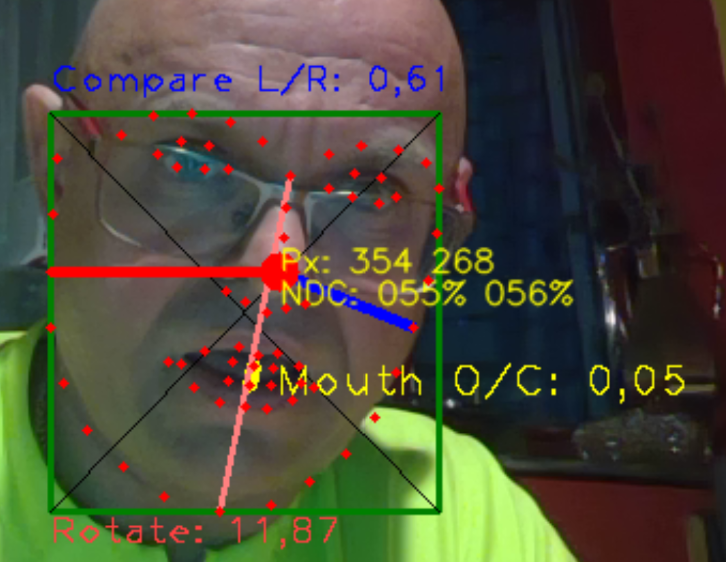

# OpenCV Face68 Nose Mouth BoundingBox Example (OCV-face68-Nose-Mouth-BB)

Example with Unity, OpenCV and Face68 Detection. Nose and Mouth calculation. Including normalization with NDC (noramlized device coordinates).



## Nose and NoseNDC (normaliced device coordinates = NDC)
Nose-Size calculation with BoundingBox (see code below).
```
Point nosePoint = new Point(points[pointMitte].x, points[pointMitte].y);
int noseThick = Convert.ToInt32((faceBBMax.x - faceBBMin.x) * 0.03);
Imgproc.circle(rgbMat, nosePoint, noseThick, new Scalar(255, 255, 255), -1);
// Text Info Pixel
Imgproc.putText(rgbMat, "Px: "+ points[30].x+" "+points[30].y, nosePoint,  Imgproc.FONT_HERSHEY_SIMPLEX, 0.5, new Scalar(255, 255, 0), 1, Imgproc.LINE_AA, false);

// Text Info NDX 
float noseX = points[pointMitte].x / rgbMat.width();
float noseY = points[pointMitte].y / rgbMat.height();
DMT.StaticStore.NoseNDC = new Vector2(noseX, noseY);
```

## Mouth and MouthDistance in NDC

```
float mouthDistanz = Vector2.Distance(points[mouthOben], points[mouthUnten]); // 51-57 62-66
Imgproc.line(rgbMat, new Point(points[mouthOben].x, points[mouthOben].y), new Point(points[mouthUnten].x, points[mouthUnten].y), new Scalar(0, 0, 128), 3);

DMT.StaticStore.MouthOpen = mouthDistanz;
double blueHeight = faceBBMax.y - faceBBMin.y;
double mouthNDC = mouthDistanz / blueHeight;

String mouthTxt = "Mouth O/C: " + mouthNDC.ToString("0.00");
Imgproc.putText(rgbMat, mouthTxt, new Point(points[mouthOben].x+10, (points[mouthOben].y+ points[mouthUnten].y)/2+10),
Imgproc.FONT_HERSHEY_PLAIN, 1.4, new Scalar(255, 255, 0), 1, Imgproc.LINE_4, false);

```

## BB BoundingBox own calculation

```
Point faceBBMin = new Point(999, 999);
Point faceBBMax = new Point(0, 0);
for (run = 0; run < points.Count; run++) // check all Points
{
    if (points[run].x > faceBBMax.x) faceBBMax.x = points[run].x;
    if (points[run].y > faceBBMax.y) faceBBMax.y = points[run].y;
    if (points[run].x < faceBBMin.x) faceBBMin.x = points[run].x;
    if (points[run].y < faceBBMin.y) faceBBMin.y = points[run].y;
}

DMT.StaticStore.myBoundingBox = new UnityEngine.Rect((float)faceBBMin.x, (float)faceBBMin.y, (float)faceBBMax.x - (float)faceBBMin.x, (float)faceBBMax.y - (float)faceBBMin.y);

DMT.StaticStore.myBoundingBoxNDC =
new UnityEngine.Rect(
  (float)faceBBMin.x/ rgbMat.width(), (float)faceBBMin.y/rgbMat.height(), 
  ((float)faceBBMax.x - (float)faceBBMin.x) / rgbMat.height(), 
  ((float)faceBBMax.y - (float)faceBBMin.y) / rgbMat.height() );

Imgproc.rectangle(rgbMat, faceBBMin, faceBBMax, new Scalar(0, 128, 0), 2);
Imgproc.line(rgbMat, new Point(faceBBMin.x, faceBBMin.y), new Point(faceBBMax.x, faceBBMax.y), new Scalar(0, 0, 0), 1);
Imgproc.line(rgbMat, new Point(faceBBMax.x, faceBBMin.y), new Point(faceBBMin.x, faceBBMax.y), new Scalar(0, 0, 0), 1);
```

### Points definition (for 68 Face Points)
```
private const byte pointMitte = 33; // Nose
private const byte mouthOben = 62;
private const byte mouthUnten = 66;

private const byte pointOben = 27;
private const byte pointUnten = 8;
private const byte pointLeft = 2;
private const byte pointRight = 14;
```
